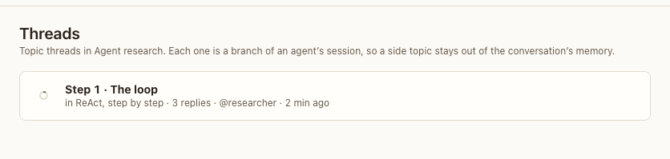

# Threads view

**Where:** Threads in the rail (#/p/<project>/threads).

## Why it exists

Threads stay findable after you close the panel: topic threads, each a branch of an agent’s memory, and side threads, where agents talk to each other (#124).

## Expected functionality

- Lists the project’s topic threads and side threads together, newest activity first, and each says which kind it is.
- A topic thread: “Topic thread · in <conversation> · n replies · @agents · when”.
- A side thread: its pair as the title (“@a ↔ @b”), then “Side thread · in <conversation> · n messages · <the agent at work there and what it’s doing, such as “@b is calling tools”, “@b needs you” or “@b failed”, or idle> · when”, with that agent’s ring, or the pair’s.
- Each opens the thread in the panel beside its conversation.
- A press on a thread isn’t lost when the list redraws under it, as it does with each status change while an agent works (#1010): while the mouse or Space is down, the redraw waits until the press ends, after its click, or 3 s after it began.
- An empty state explains how to start one, and that side threads show here when an agent wakes another.

## Steps to reproduce

1. Run the demo (`node tools/demo.mjs --port 4180`) and open <http://127.0.0.1:4180/> while it plays; keep the tab open.
2. After the demo, open Agent research › Threads, and open the thread.
3. In a conversation where one agent woke another, open the project’s Threads.
4. Run `npx playwright test work-threads-press` (`tests/browser/work-threads-press.spec.mjs`): a press held on a thread while the page redraws.

**Pass if:** The thread opens in the panel with its replies, and the side thread is listed as a side thread with its pair, state, message count and last activity. The spec passes: the held press opens its thread.

## Related

- [topic thread panel](../conversation/panels/topic-thread-panel.md)
- [side thread panel](../conversation/panels/side-thread-panel.md)
